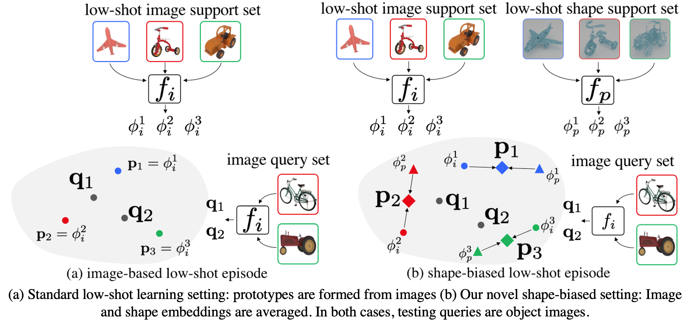

# LSSB: Low-Shot learning with Shape Bias - CVPR2021



This is a repository containing PyTorch code for [Using Shape to Categorize: Low-Shot Learning with an Explicit Shape Bias](https://openaccess.thecvf.com/content/CVPR2021/html/Stojanov_Using_Shape_To_Categorize_Low-Shot_Learning_With_an_Explicit_Shape_CVPR_2021_paper.html). You can find instructions for for testing pre-trained models in the paper and training your own models in the instructions below.

If you use our work in your research, please consider citing 

```bibtex
@article{stojanov21cvpr,
      title={Using Shape to Categorize: Low-Shot Learning with an Explicit Shape Bias},
      author={Stefan Stojanov and Anh Thai and James M. Rehg},
      booktitle = {CVPR},
      year      = {2021}
}
```

### Project Members
- [Stefan Stojanov](https://sstojanov.github.io) - Georgia Institute of Technology (PhD Student)
- [Anh Thai](https://anhthai1997.wordpress.com) - Georgia Institute of Technology (PhD Student)
- [James M. Rehg](http://rehg.org) - Georgia Institute of Technology

### Contact
If you have any questions regarding the paper, data or code, please email Stefan Stojanov at [sstojanov@gatech.edu](mailto:sstojanov@gatech.edu)

## Toys4K 3D Object Dataset


Details for downloading and rendering the Toys4K 3D object dataset are available in the [Toys4K directory](toys4k) of this repository.

## Results - Shape Bias Improves Low-Shot Generalization

The following results are averaged over three runs for FEAT and five runs for SimpleShot

### ModelNet

| Method          | 1-shot 5-way  | 5-shot 5-way  | 1-shot 10-way  | 5-shot 10-way  |
| -------------   |:-------------:|:-------------:|:--------------:|:--------------:|
| SimpleShot      |58.99	    |74.29          |45.82           |62.73           |
| LSSB SimpleShot |57.57          |74.39          |49.84           |64.21           |
| FEAT            |58.30          |71.54          |45.41           |60.44           |
| LSSB FEAT       |62.84          |74.84          |51.49           |63.80           |

### ShapeNet

| Method          | 1-shot 5-way  | 5-shot 5-way  | 1-shot 10-way  | 5-shot 10-way  | 1-shot 20-way  | 5-shot 20-way  |
| -------------   |:-------------:|:-------------:|:--------------:|:--------------:|:--------------:|:--------------:|
| SimpleShot      | 66.73	    | 80.93	        | 53.37          | 70.32          | 41.09          | 59.09          |
| LSSB SimpleShot | 67.50	    | 81.30	        | 54.99	       | 71.24	      | 43.60	     | 61.03          |
| FEAT            | 67.81	    | 81.45	        | 55.69          | 71.74          | 44.44	     | 61.46          |
| LSSB FEAT       | 70.24         | 80.95         | 58.45          | 70.95          | 47.03          | 60.43          |

### Toys4K

| Method          | 1-shot 5-way  | 5-shot 5-way  | 1-shot 10-way  | 5-shot 10-way  | 1-shot 20-way  | 5-shot 20-way  |
| -------------   |:-------------:|:-------------:|:--------------:|:--------------:|:--------------:|:--------------:|
| SimpleShot      |68.78	    | 83.69	        | 55.22          | 73.58          | 43.05          | 62.64          |
| LSSB SimpleShot |70.96	    | 81.33	        | 58.47          | 70.81	      | 46.96          | 60.30          |
| FEAT            |70.86	    | 84.13	        | 57.15          | 74.29	      | 44.84          | 63.65          |
| LSSB FEAT       |71.58	    | 81.45	        | 59.09          | 71.00          | 47.45          | 59.98          |


## Installation

For this project we use [miniconda](https://docs.conda.io/en/latest/miniconda.html) to manage dependencies. After setting it up, you can install the `lssb` environment
```bash
conda env create -f environment.yml
conda activate lssb

pip install -e .
```

The most important dependencies to get right are PyTorch 1.6 and PyTorch Lightning 0.8.4. Since this project uses [PyTorch Lightning](https://www.pytorchlightning.ai/), if you want to make significant modifications to the code it will be helpful to look into the overall PL workflow.

Make sure you install PyTorch with a compatible CUDA version. This repository has been tested with CUDA>10.1.

## Datasets

You can download the data we used for the experiments for ModelNet, ShapeNet and our Toys4K dataset using `download_data.sh`.

Attribution information about our new dataset is available [here](https://www.dropbox.com/s/1hjmoh5kkcq7p7u/toys4k_attribution.pdf). Please do not distribute the data made available here in any way, and please make sure you follow the respective ModelNet and ShapeNet licenses.

The approximate sizes for the datasets are 7.4GB for ModelNet, 11GB for ShapeNet55 and 4.1GB for Toys4K

For training and testing with shape bias use `download_features.sh` to download extracted DGCNN point cloud features.

## Code Organization
Following is an outline of the LSSB codebase
```
lssb - main code directory
    - data - PyTorch dataset classes
        - modelnet.py - dataset class for ModelNet
        - sampler.py - low-shot batch sampler code
        - shapenet.py - datset class for ShapeNet
        - toys.py - dataset clas for Toys4K
        - transform.py - code for image and point cloud transformations
    - feat_extract - code for feature extraction from point clouds
        - extract_simpleshot_pc_feature_modelnet.py - ModelNet feature extraction
        - extract_simpleshot_pc_feature_shapenet.py - ShapeNet feature extraction
        - extract_simpleshot_pc_feature_toys4.5k.py - Toys feature extraction
        - utils.py - util functions for feature extraction
    - lowshot
        - configs
            - feat - config files for training FEAT models on all 3 datasets
            - simpleshot - config files for training SimpleShot models or all 3 datasets
        - models
            - base_feat_classifier.py - base class for FEAT classifier
            - base_simpleshot_classifier.py - base class for SimpleShot classifier
            - image_feat_classifier.py - subclass for image-based FEAT classifier
            - image_simpleshot_classifier.py - sublcass for image-based SimpleShot classifier 
            - joint_feat_classifier.py - subclass for shape-biased FEAT classifier
            - joint_simpleshot_classifier.py - subclass for shape-biased SimpleShot classifier
            - ptcld_simpleshot_classifier.py - subclass for point-cloud based SimpleShot classifier
        - utils
            - feat_utils.py - util functions specific to FEAT
            - simpleshot_utils.py - util functions specifict to SimpleShot
            - train_utils.py - just contains a function to return dataset objects; used across all methods
        - test.py - main testing script; used for all methods
        - train.py - main training script; used for all methods
    - nets
        - ResNet.py - borrowed from torchvision, definitons of ResNet models
        - dgcnn.py - definition of DGCNN point cloud classifier
        - feat.py - definition of FEAT transformer module
```

## Evaluate Pre-Trained Models
First download the pretrained models (approx. 8.3GB)
```
bash download_models.sh
```
Once the models are downloaded, please use the scripts in `testing_scripts` to test the pretrained models e.g.
```
bash testing_scripts/test_simpleshot_modelnet.sh
```
## Training From Scratch
To train models from scratch, please use the scripts in `training_scripts` e.g.
```
bash training_scripts/train_resnet18_simpleshot.sh 0 
```

### Notes for training and testing with shape bias:
To train the shape biased image encoder, feature extraction needs to be done to save on compute. An example command is
```
python lssb/feat_extract/extract_simpleshot_pc_feature_modelnet.py --ckpt_path=pretrained_models/simpleshot/modelnet/ptcld-only/dgcnn-modelnet-simpleshot/version_0/checkpoints/epoch\=176_val_acc\=0.765.ckpt
```
Once this is completed, the `.npz` file should be moved to the dataset directory, under a new directory called `features`. You can download extracted features using `download_features.sh` as in the instructions above.

To train the shape-biased FEAT models, a shape-biased simpleshot checkpoint is needed. In the appropriate config file for the encoder add for example
```
encoder_path_resnet: pretrained_models/simpleshot/modelnet/shape-biased/joint-modelnet-pairwise-simpleshot/version_0/checkpoints/epoch=360_val_acc=0.718.ckpt
```
if you have downloaded the pretrained models.

## Code Credits
We are grateful for the authors of the following code repositories, from where we borrow components used in this repository
* [DGCNN](https://github.com/AnTao97/dgcnn.pytorch)
* [FEAT](https://github.com/Sha-Lab/FEAT)
* [PointNet/PointNet2-PyTorch](https://github.com/yanx27/Pointnet_Pointnet2_pytorch)
* [PointNet2-PyTorch](https://github.com/erikwijmans/Pointnet2_PyTorch)
* [RFS](https://github.com/WangYueFt/rfs/)
* [SimpleShot](https://github.com/mileyan/simple_shot)
